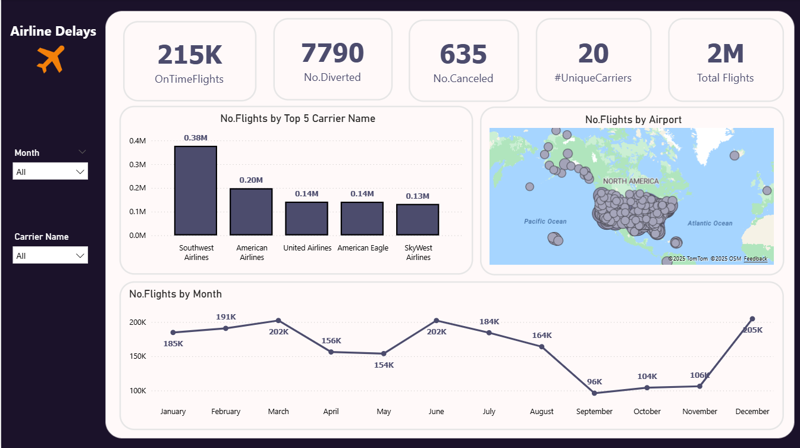
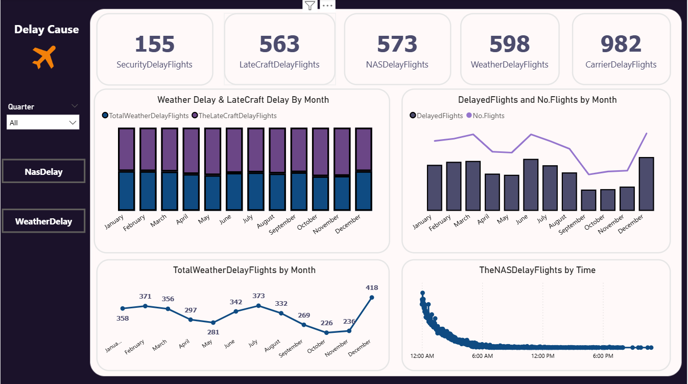
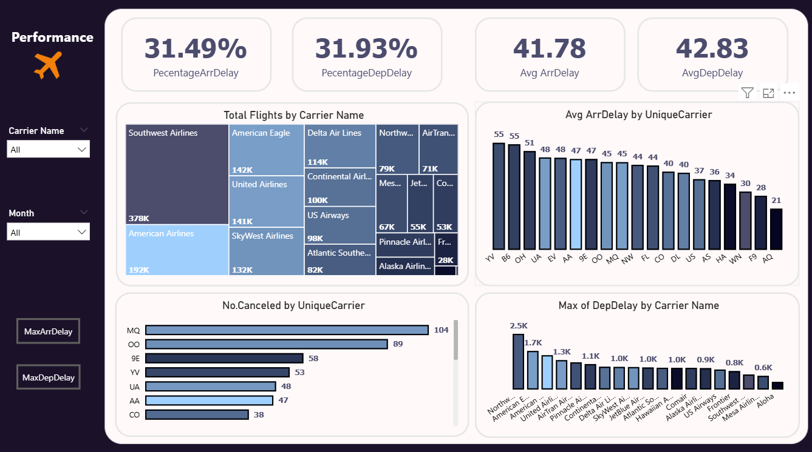
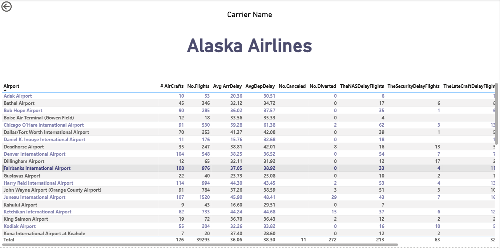

# ✈️ Airline Flights Analysis Dashboard

## 📖 Project Overview
This Power BI project was developed as part of the **Information Technology Institute (ITI)** training program.  
It analyzes **Airline Flight data**, offering insights into flight performance, delay causes, and airline efficiency.  
The project included cleaning, transforming, modeling flight data, and creating a **multi-page Power BI dashboard**.

---

## 🧩 Key Features
- Cleaned and modeled flight data for analytics.  
- Built **Date & Time dimension tables**.  
- 4-page Power BI dashboard: **Overview, Delay Cause, Performance, Drillthrough**.  

---

## 📊 Key Insights
- Out of **2 million flights**, **215K were on time**.  
- **7,790** diverted, **635** canceled.  
- **Southwest Airlines** had ~378K flights (highest volume).  
- **Mesa Airlines** → 67K flights, 55-min avg delay (highest delay).

---

## 🖼️ Dashboard Pages

| Overview Page | Delay Cause Page |
|---------------|----------------|
|  |  |

| Performance Page | Drillthrough Page |
|-----------------|-----------------|
|  |  |

---

## ⚙️ Tools
- **Power BI, Power Query, DAX, SQL**

---

### 🧑‍💻 Author
**Omar Zahran**  
📫 [LinkedIn](https://linkedin.com/in/omar-zahran) | [GitHub](https://github.com/yourusername)
